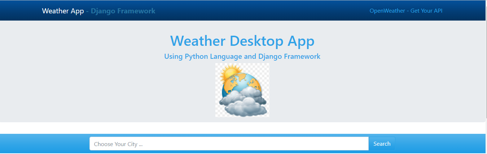

# Weather Detection App 

This is the Weather Detection App using [Django](https://www.djangoproject.com/). Give it your desired location and hit enter it will give your desired result.

* Simple Design Template
* Weather API is used 
* No Bootstrap 
* No Any Framework
* Django Static Files are used 
* [SQL Lite3](https://www.sqlite.org/index.html) Database (Default Database of [Django](https://www.djangoproject.com/))

## Screenshot:
Front Page of Site lookes like this (you can set design according to your need).
Enter City or Country name in input box where placesholder is "Choose Your City"

Result after searching your desired city of country, which includes 
* Country Name
* Country Code
* Coordinates in the form of X and Y
* Temperatur in C
* Feels like (how you feel)
* Minimum and Maximum Temperature in that area
* Pressure 
* Humidity
* Wind Speed 
* Forecast
* Description
* Sunrise and Sunset

## How to Run on your machince?

* Download it from [github](https://github.com/)
* Install Virtual Environment in your laptop through this command using `pip`,
    `pip install virtualenv`
* Give virtualenv name of your own desire using 
    `virtualenv name_of_your_virtual_environment`
* Activate that Virtual Environment using `name_of_your_virtual_environment\scripts\activate`
* Install Django in that Virtual Environment after activating using `pip install django` 
* Copy DjangoWeatherApp in folder in which you added Virtual Environment
* Move in that folder manually or by using command prompt
* Run `DjangoWeatherApp` using `python manage.py runserver`